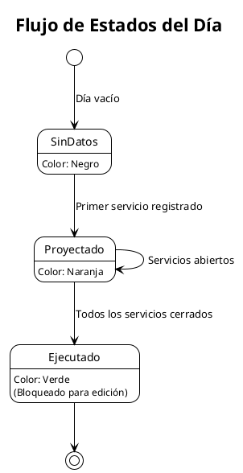
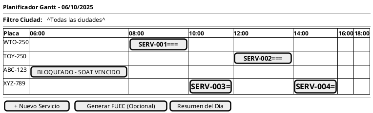
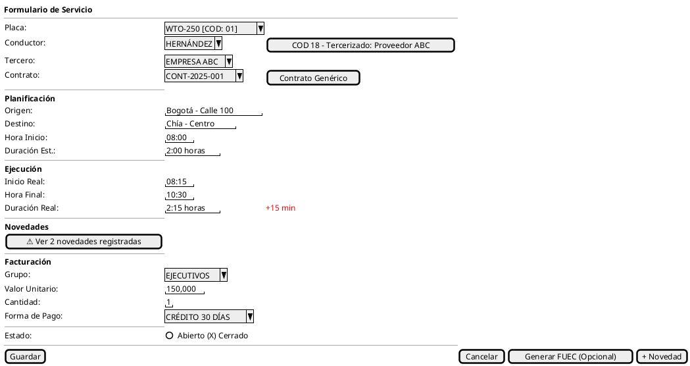
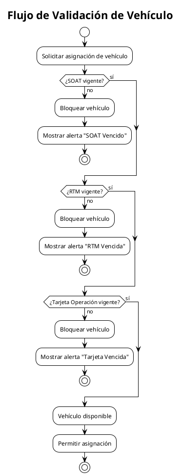
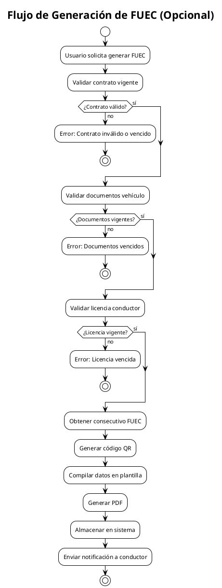
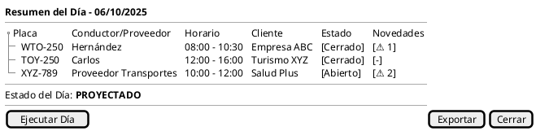
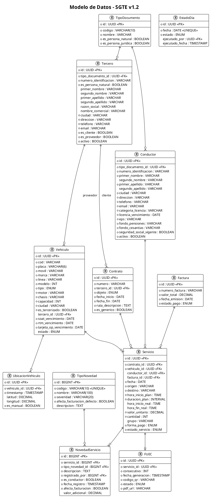

# Special Transport Management System (SGTE)

## Software Requirements Specification

**Version:** 1.2  
**Date:** February 2026  
**Client:** Special Transport Company - Colombia

---

## 1. Introduction

### 1.1 Purpose

Web-based system for the operational management of special transport in Colombia, focused on the visual planning of services through a Gantt chart, with an optional module for generating the FUEC (Formato Único de Extracto de Contrato).

### 1.2 Scope

- Fleet management and legal documentation
- Service planning and dispatching
- FUEC generation module (optional, initially disabled)
- Driver management
- Third-party management (clients and providers)
- Operational and accounting status control
- Service invoicing
- Incident and event management
- Email notifications

### 1.3 Transport Modalities Included

- Corporate Transport
- Tourist Transport
- Health Transport
- Occasional Transport

> School transport is NOT included in this scope.

---

## 2. Glossary

| Term                     | Definition                                                                                                      |
| ------------------------ | --------------------------------------------------------------------------------------------------------------- |
| **FUEC**                 | Formato Único de Extracto de Contrato — Optional legal document for special transport operation                 |
| **SOAT**                 | Mandatory Traffic Accident Insurance (Seguro Obligatorio de Accidentes de Tránsito)                             |
| **RTM**                  | Technical-Mechanical Inspection (Revisión Técnico-Mecánica)                                                     |
| **Tarjeta de Operación** | Document that authorizes a vehicle to provide special transport services                                        |
| **Service**              | Assignment of a specific trip to a vehicle and driver                                                           |
| **Service Status**       | Operational condition: "Abierto" or "Cerrado"                                                                   |
| **Day Status**           | Accounting condition: "Proyectado" or "Ejecutado"                                                               |
| **Invoice**              | Accounting document that records the charge for a service provided                                              |
| **Notification**         | Automatic message sent by email to users based on system events                                                 |
| **COD**                  | Internal vehicle code combined between the table and the cost center                                            |
| **TERCERO**              | Unified entity representing natural or legal persons (clients, providers, except drivers)                       |
| **PROVEEDOR**            | Third party that provides outsourced vehicles for the operation                                                 |
| **NOVEDAD**              | Incident or event recorded during the execution of a service that may affect invoicing                          |

---

## 3. Navigation Architecture

```plantuml
@startuml
!theme plain
title Mapa de Navegación - SGTE

[*] --> Login
Login --> DashboardGeneral

state DashboardGeneral {
  [*] --> PanelKPIs
  PanelKPIs : KPIs, Alertas, Accesos rápidos
  PanelKPIs : Actividad reciente
}

state Produccion {
  [*] --> CalendarioAnual
  CalendarioAnual --> VistaMes : Doble click en mes
  VistaMes --> VistaDia : Click en día
  VistaDia --> GanttDiario : Ver planificador
  VistaDia --> ResumenDia : Ver resumen
}

state GanttDiario {
  [*] --> VistaFlota
  VistaFlota --> FormularioServicio : Click en barra/celda
  FormularioServicio --> VistaFlota : Guardar/Cancelar
  FormularioServicio --> GestionNovedades : Registrar novedad
}

state Administracion {
  [*] --> GestionFlota
  GestionFlota --> DetalleVehiculo
  [*] --> GestionConductores
  GestionConductores --> DetalleConductor
  [*] --> GestionContratos
  GestionContratos --> DetalleContrato
  [*] --> GestionTerceros
  GestionTerceros --> DetalleTercero
  [*] --> GestionFacturacion
  [*] --> GestionNovedades
}

DashboardGeneral --> Produccion : Menú lateral
DashboardGeneral --> Administracion : Menú lateral
DashboardGeneral --> GenerarFUEC : Generar FUEC (Opcional)
DashboardGeneral --> Settings : Menú usuario

state Settings {
  [*] --> Perfil
  Perfil : Nombre, Email
  [*] --> Contrasena
  Contrasena : Cambiar contraseña
  [*] --> Apariencia
  Apariencia : Tema claro/oscuro/sistema
  [*] --> Seguridad2FA
  Seguridad2FA : TOTP activar/desactivar
}

@enduml
```

---

## 4. Functional Requirements

### REQ-001: Calendar and Status Management

**User Story:** As a dispatcher, I want to visualize the operational status of each day of the year so I can quickly identify days with projected or executed services.

#### Acceptance Criteria

1. WHEN the user accesses the production module THEN the system SHALL display an annual calendar view with the 12 months.

2. WHEN the user double-clicks on a month THEN the system SHALL display the detailed view of the days of that month.

3. WHILE a day has no recorded services THEN the system SHALL display the day in black.

4. WHEN at least one service is recorded on a day THEN the system SHALL change the day color to orange and set the status to "Proyectado".

5. WHEN all services for a day have the "Cerrado" status THEN the system SHALL allow changing the day status to "Ejecutado" and display the day in green.



---

### REQ-002: Daily Fleet View (Gantt)

**User Story:** As a dispatcher, I want to see all vehicles and their assigned services in a Gantt chart to efficiently plan the day's operation.

#### Acceptance Criteria

1. WHEN the user selects a day THEN the system SHALL display a list of all fleet vehicles on the Y axis.

2. WHEN the user views the Gantt THEN the system SHALL display the hours of the day (00:00-24:00) on the X axis.

3. WHEN a vehicle has assigned services THEN the system SHALL display horizontal bars representing each service with its duration.

4. WHEN the user clicks on an empty cell of the Gantt THEN the system SHALL open the new service form with the vehicle and time pre-selected.

5. WHEN the user clicks on an existing service bar THEN the system SHALL open the service edit form.

6. WHILE a vehicle has expired documents (SOAT, RTM, Tarjeta de Operación) THEN the system SHALL display the vehicle row in gray and block service assignment.

7. WHEN the user accesses the Gantt THEN the system SHALL display a filter by vehicle city to facilitate planning by location.



---

### REQ-003: Service Form (Production)

**User Story:** As a dispatcher, I want to record all data of a transport service to control operations and manage invoicing.

#### Acceptance Criteria

1. WHEN the user creates a new service THEN the system SHALL require the following mandatory fields:
   - Vehicle plate
   - Assigned driver (if the vehicle is not outsourced)
   - Client/Third party (contract)
   - Origin
   - Destination
   - Trip start time (planned)
   - Estimated duration

2. WHEN the user selects a vehicle with COD 18 (outsourced) THEN the system SHALL:
   - Hide the assigned driver field
   - Display information about the provider third party associated with the vehicle
   - Allow continuing with the service registration

3. WHEN the user saves a service THEN the system SHALL validate that the vehicle has no schedule conflicts with other services.

4. WHEN the service is executed THEN the driver SHALL confirm start, completion and register incidents, allowing the system to capture:
   - Actual start time
   - Actual end time
   - Actual duration (automatically calculated)
   - Incidents or events

5. WHEN the user attempts to assign a driver THEN the system SHALL validate that the driver has a valid license and up-to-date social security.

6. WHILE the day status is "Ejecutado" THEN the system SHALL block editing of all service fields. Users with the Accounting role may edit only the accounting and invoicing fields.

7. WHEN incidents are recorded on the service THEN the system SHALL display a visual indicator on the form and allow consulting the details of the recorded incidents.



---

### REQ-004: Fleet Management

**User Story:** As an administrator, I want to manage vehicle information and their legal documents to ensure regulatory compliance.

#### Acceptance Criteria

1. WHEN the administrator registers a vehicle THEN the system SHALL require:
   - Plate
   - COD (internal code combined with cost center)
   - Mobile number
   - Make
   - Line
   - Model (year)
   - Vehicle type (Bus, Buseta, Van, Automóvil)
   - Engine number
   - Chassis number
   - Passenger capacity
   - Location city (for filter in Gantt)
   - Expiration dates: SOAT, RTM, Tarjeta de Operación

2. WHEN the vehicle COD is 18 THEN the system SHALL:
   - Mark the vehicle as outsourced
   - Require linking a provider third party
   - Apply different display logic in the service form

3. WHEN 30, 15 or 5 days remain before a document expires THEN the system SHALL generate automatic alerts.

4. WHEN a vehicle document is expired THEN the system SHALL automatically block the vehicle in the Gantt planner.

5. IF the user attempts to generate a FUEC (optional) for a vehicle with expired documents THEN the system SHALL reject the operation and display the reason for the block.



---

### REQ-005: Driver Management

**User Story:** As an administrator, I want to manage driver information to ensure that only authorized personnel operate the vehicles.

#### Acceptance Criteria

1. WHEN the administrator registers a driver THEN the system SHALL require:
   - Identification document type
   - Identification document number
   - First name
   - Middle name (optional)
   - First surname
   - Second surname (optional)
   - City of residence
   - Main address
   - Contact phone
   - Email
   - License category
   - License expiration date
   - EPS (Entidad Promotora de Salud — selected from catalog)
   - Pension fund (selected from catalog)
   - Severance fund (selected from catalog)
   - Valid social security status

2. WHEN attempting to assign a driver to a service THEN the system SHALL validate that the license category matches the vehicle type.

3. WHEN the driver's license is expired THEN the system SHALL block their assignment to services.

4. WHEN 30, 15 or 5 days remain before the license expires THEN the system SHALL generate automatic alerts.

5. WHEN the driver's social security is not up-to-date THEN the system SHALL display a warning and record the incident.

---

### REQ-006: Contract Management

**User Story:** As an administrator, I want to manage contracts with third parties to properly link services.

#### Acceptance Criteria

1. WHEN the administrator creates a contract THEN the system SHALL require:
   - Contract number
   - Associated third party (client)
   - Contract object (Empresarial, Turismo, Salud, Ocasional)
   - Validity start and end date
   - Authorized route description
   - Generic contract indicator (temporary)

2. WHEN attempting to create a service THEN the system SHALL allow selecting a valid contract or generating a temporary generic contract.

3. IF the service date is outside the contract validity period THEN the system SHALL reject the service creation or allow generating a generic contract if applicable.

4. WHEN a generic contract is created THEN the system SHALL:
   - Assign an automatic number
   - Mark it as temporary
   - Allow its immediate use for services

---

### REQ-007: FUEC Generation

**User Story:** As a dispatcher, I want to have the option to generate the FUEC to comply with special transport regulations when necessary.

> **Important note:** This module is OPTIONAL and is initially DISABLED. The related logic remains in the system so that it can be activated or resumed in the future. FUEC-related fields are optional and do not affect the main operation of the system.

#### Acceptance Criteria

1. WHEN the user requests FUEC generation THEN the system SHALL validate:
   - Valid associated contract
   - Vehicle with valid documents
   - Driver with valid license

2. WHEN all validations are successful THEN the system SHALL generate a PDF with:
   - Contract data
   - Vehicle data
   - Driver data
   - Origin and destination
   - Service date and time
   - Verification QR code
   - Unique consecutive number

3. WHEN the FUEC is generated THEN the system SHALL assign a consecutive number from the range authorized by MinTransporte.

4. WHEN the FUEC QR code is scanned THEN the system SHALL display a verification page with the status of the document ("Vigente"/"Anulado").

5. WHEN the FUEC module is disabled THEN the system SHALL NOT perform validations that depend on FUEC generation.



---

### REQ-008: Day Summary

**User Story:** As a supervisor, I want to see a consolidated summary of all the day's services for operational control.

#### Acceptance Criteria

1. WHEN the user accesses the "Resumen del Día" THEN the system SHALL display a table with:
   - Vehicle plate
   - Assigned driver (or provider if outsourced)
   - Service schedules
   - Status of each service
   - Recorded incidents indicator

2. WHEN all services of the day are in "Cerrado" status THEN the system SHALL enable the "Ejecutar Día" button.

3. WHEN the user executes the day THEN the system SHALL change the day status to "Ejecutado" and block modifications.



---

### REQ-009: Accounting Immutability Control

**User Story:** As an administrator, I want executed records to be protected against modifications to ensure accounting integrity.

#### Acceptance Criteria

1. WHILE the day status is "Ejecutado" THEN the system SHALL block all service fields for users with the Dispatcher role.

2. WHEN a user with the Administrator role needs to modify any field of an executed record THEN the system SHALL require mandatory justification.

3. WHEN a user with the Accounting role edits an executed record, the system SHALL allow them to modify only the accounting and invoicing fields.

4. WHEN an executed record is modified THEN the system SHALL log in the audit trail:
   - User who made the change
   - Date and time
   - Previous value
   - New value
   - Justification (mandatory for Administrators)

---

### REQ-010: Vehicle Location Tracking

**User Story:** As a dispatcher, I want to monitor the current location of vehicles for better operational management.

> **Note:** GPS usage is OPTIONAL. Location may be captured automatically via the mobile device's GPS or entered manually using coordinates.

#### Acceptance Criteria

1. WHEN a vehicle is in service AND GPS is enabled THEN the system SHALL record and display the current location of the vehicle.

2. WHEN the driver updates the location THEN the system SHALL store the GPS coordinates and timestamp, indicating whether it was entered manually.

3. WHEN the location is queried THEN the system SHALL display a map with the current position of active vehicles.

4. WHEN GPS is not available THEN the system SHALL allow manual recording of coordinates without blocking the operation.

---

### REQ-011: Service Invoicing

**User Story:** As an accountant, I want to manage service invoicing to record associated charges.

#### Acceptance Criteria

1. WHEN a service is closed THEN the system SHALL allow linking an invoice number to the service.

2. WHEN an invoice is recorded THEN the system SHALL store:
   - Invoice number
   - Total amount
   - Issue date
   - Payment status

3. WHEN a service is consulted THEN the system SHALL display the associated invoicing information.

4. WHEN an incident affects invoicing THEN the system SHALL calculate the corresponding additional amount or discount.

---

### REQ-012: Incident/Event Management

**User Story:** As a driver or administrator, I want to record incidents during the execution of a service in order to document events that may affect operations and invoicing.

#### Acceptance Criteria

1. WHEN the driver accesses an assigned service THEN the system SHALL allow recording an incident at any time.

2. WHEN the administration role accesses a service THEN the system SHALL allow recording an incident at any time.

3. WHEN an incident is recorded THEN the system SHALL store:
   - Incident type (configurable dropdown)
   - Detailed description
   - User who recorded the incident
   - Date and time of record
   - Indicator of whether it was recorded by the driver
   - Indicator of whether it affects invoicing
   - Additional amount or discount (if applicable)

4. WHEN an incident affects invoicing THEN the system SHALL:
   - Mark the service with a visual indicator
   - Include the incident in the total amount calculation
   - Show the detail in the invoicing summary

---

### REQ-013: Email Notifications

**User Story:** As a system user, I want to receive email notifications about relevant events to stay informed without needing to be connected.

#### Acceptance Criteria

1. WHEN a service is assigned to a driver THEN the system SHALL send a notification to the driver with the service data.

2. WHEN a vehicle document or driver's license is about to expire (30, 15 or 5 days) THEN the system SHALL send a notification to the administrator.

3. WHEN an incident that affects invoicing is recorded THEN the system SHALL notify the administrator and the accounting role.

4. WHEN a day is executed THEN the system SHALL notify the accounting role that the records are available for invoicing.

5. WHEN a driver confirms the completion of a service THEN the system SHALL send a notification to the administrator with the data of the completed service.

6. WHEN the system sends a notification THEN it SHALL log: type, recipient, message, sending date and delivery status.

---

### REQ-014: Initial Data Insertion (Seeders)

**User Story:** As an administrator, I want the system to come with pre-loaded initial data so it can operate immediately after installation.

#### Acceptance Criteria

1. The system SHALL include database initialization scripts (`seeders` in Laravel).
2. The `seeders` SHALL automatically load:
   - Basic catalogs (Roles, Permissions, Document Types, Incident Types).
   - A default Administrator user.
   - Parameterized initial data of Vehicles, Drivers and Third parties as provided by the client.
3. The installation process SHALL execute these `seeders` as part of the initial deployment.

---

## 5. Non-Functional Requirements

### NFR-001: Performance

- The Gantt must render up to 100 vehicles and 300 services without visible degradation (FPS > 30).
- Changes in the Gantt must be reflected in less than 2 seconds for other users.

### NFR-002: Availability

- The system must be available 99.5% of the time during operating hours (5:00 - 22:00).

### NFR-003: Security

- Authentication via username and password.
- Defined roles: Administrator, Operations, Driver, Accounting.
- Encrypted communication (HTTPS).
- Immutable audit log.

### NFR-004: Compatibility

- Browsers: Chrome, Edge, Firefox (last 2 versions).
- Minimum resolution: 1366x768.

### NFR-005: Optional GPS

- GPS tracking is optional; the system must work fully without it.
- Location may be entered manually via coordinates when GPS is not available.

---

## 6. Data Model



### Table Relationships

| Source Table  | Target Table      | Relationship Type             |
| ------------- | ----------------- | ----------------------------- |
| TipoDocumento | Tercero           | One-to-Many                   |
| TipoDocumento | Conductor         | One-to-Many                   |
| Tercero       | Vehiculo          | One-to-Many (if provider)     |
| Tercero       | Contrato          | One-to-Many (if client)       |
| Contrato      | Servicio          | One-to-Many                   |
| Vehiculo      | Servicio          | One-to-Many                   |
| Conductor     | Servicio          | One-to-Many                   |
| Factura       | Servicio          | One-to-Many                   |
| TipoNovedad   | NovedadServicio   | One-to-Many                   |
| Servicio      | NovedadServicio   | One-to-Many                   |
| Servicio      | FUEC              | One-to-One                    |
| Vehiculo      | UbicacionVehiculo | One-to-Many                   |

### Tables Managed by Laravel and Packages

The following tables are created and managed automatically by the framework and third-party packages. They are not included in the ERD because they are standard:

| Table(s) | Package | Purpose |
| -------- | ------- | ------- |
| `users` | Laravel Auth (react-starter-kit) | System users |
| `roles`, `permissions`, `model_has_roles`, `model_has_permissions`, `role_has_permissions` | spatie/laravel-permission | Roles and permissions |
| `activity_log` | spatie/laravel-activitylog | Audit log (REQ-009) |
| `notifications` | Laravel Notifications (database channel) | In-app and email notifications (REQ-013) |

> **Note:** `NovedadServicio.registrado_por` and `EstadoDia.ejecutado_por` are FKs to Laravel's `users` table.

---

## 7. Roles and Permissions

| Function                             | Administrador | Operación | Conductor | Contabilidad |
| ------------------------------------ | :-----------: | :-------: | :-------: | :----------: |
| Manage vehicles                      |       ✓       |     -     |     -     |      -       |
| Manage drivers                       |       ✓       |     -     |     -     |      -       |
| Manage contracts                     |       ✓       |     -     |     -     |      -       |
| Create services                      |       ✓       |     ✓     |     -     |      -       |
| Edit services (projected)            |       ✓       |     ✓     |     -     |      -       |
| Edit services (executed)             |       ✓       |     -     |     -     |      ✓       |
| Generate FUEC (optional)             |       ✓       |     ✓     |     -     |      -       |
| Execute day                          |       ✓       |     ✓     |     -     |      -       |
| View reports                         |       ✓       |     ✓     |     -     |      ✓       |
| View completed services              |       ✓       |     -     |     -     |      ✓       |
| Generate invoices                    |       ✓       |     -     |     -     |      ✓       |
| Link services to invoices            |       ✓       |     -     |     -     |      ✓       |
| Record actual times and incidents    |       -       |     -     |     ✓     |      -       |
| Receive notifications                |       ✓       |     ✓     |     ✓     |      ✓       |

---

## 8. Implementation Phases and Schedule

The project is structured to be developed over **5 calendar weeks**, distributed as follows:

### Week 1: Foundations and Master Data (Phase 1)

- Laravel setup + authentication + roles/permissions
- Database migrations (all tables)
- CRUD: Vehicles, Drivers, Third parties, Contracts
- Initial data insertion (Seeders)

### Week 2: Operational Core (Phase 2)

- Annual/monthly calendar
- Fleet Gantt chart
- Service form
- Day summary
- Day statuses and blocking logic

### Week 3: Driver and Incidents (Phase 3)

- Driver interface (confirm start/end)
- Incident and event management
- Email notifications

### Week 4: Invoicing and Auditing (Phase 4)

- Service invoicing
- Accounting immutability
- Audit log

### Week 5: Optional Modules and Deployment (Phase 5)

- FUEC (dormant module, disabled)
- Optional GPS location
- Testing and stabilization
- Production deployment with Dockploy

---

## 9. Recommended Technology Stack

| Layer                | Technology                                                                  |
| -------------------- | --------------------------------------------------------------------------- |
| **Frontend**         | React + Inertia.js + shadcn/ui (via `laravel/react-starter-kit`)            |
| **Gantt Component**  | JS library (e.g. Frappe/DHTMLX) as a React component                        |
| **Backend**          | Laravel Framework (PHP)                                                     |
| **Database**         | PostgreSQL                                                                  |
| **Authentication**   | Laravel Auth (starter kit with Inertia)                                     |
| **Real-Time**        | Laravel Reverb + Echo                                                       |
| **Search**           | Laravel Scout                                                               |
| **Scaffolding**      | Laravel Blueprint (models, migrations, controllers, requests, etc.)         |
| **Storage**          | MinIO (self-hosted, compatible with Laravel's S3 driver)                    |
| **Hosting / Infra**  | Dockploy + Linux VPS (to orchestrate App + DB + MinIO)                      |

---

## 10. Budget

### 10.1 Development Cost

- **System Development:** COP $5,000,000

### 10.2 Associated Costs

- **Hosting and Servers:** COP $360,000 / year ($30,000 / month) (Contabo)
- **Domain + SSL Certificates:** COP $80,000 / year approximately
- **Maintenance and Support:** COP $1,000,000 / year (optional)

**Estimated Annual Total (including initial development):** COP $5,440,000 - $6,440,000 first year

> Support includes bug fixes and development of minor new features.
