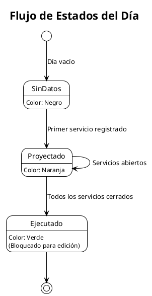
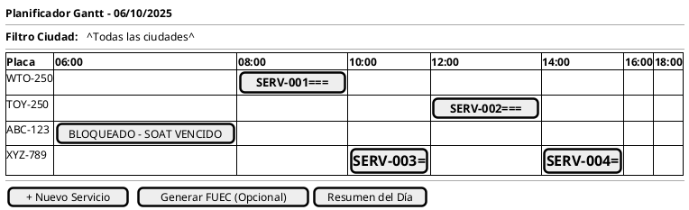
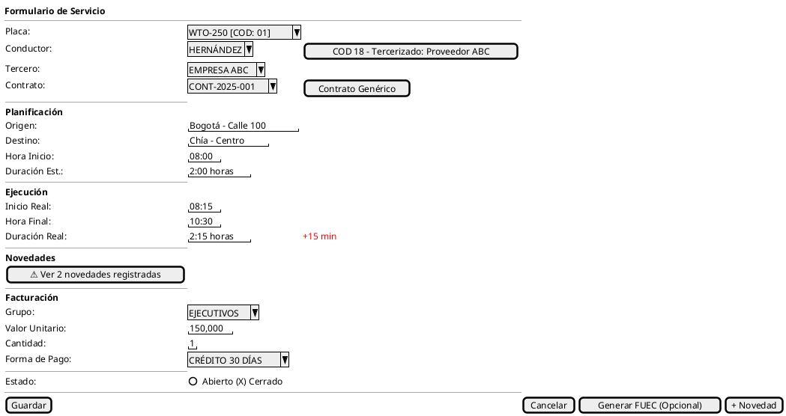
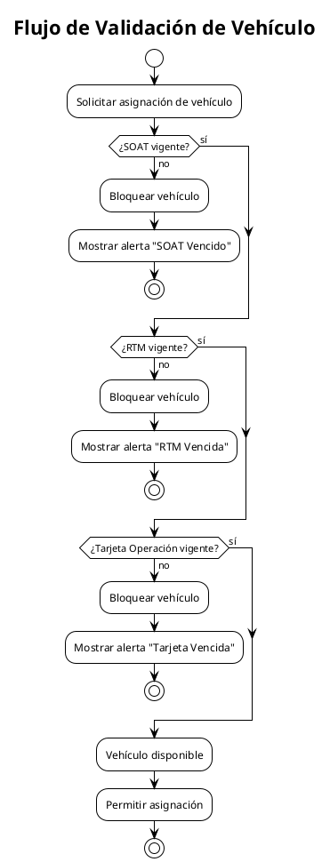
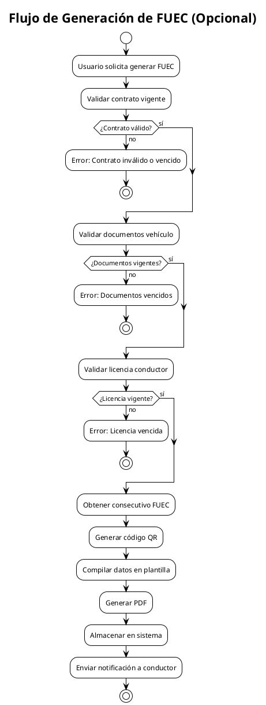
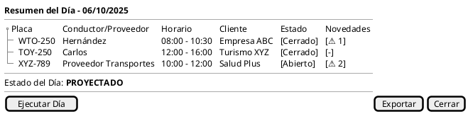
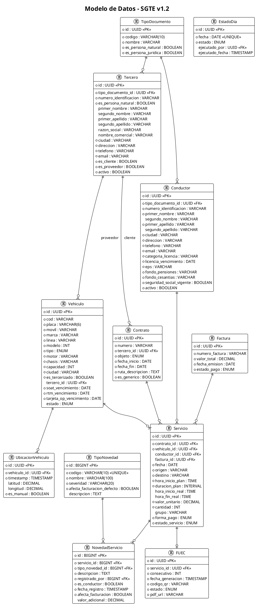

# Sistema de Gestión de Transporte Especial (SGTE)

## Documento de Requerimientos de Software

**Versión:** 1.2  
**Fecha:** Febrero 2026  
**Cliente:** Empresa de Transporte Especial - Colombia

---

## 1. Introducción

### 1.1 Propósito

Sistema web para gestión operativa de transporte especial en Colombia, centrado en la planificación visual de servicios mediante diagrama Gantt, con módulo opcional para generación del FUEC (Formato Único de Extracto de Contrato).

### 1.2 Alcance

- Gestión de flota vehicular y documentación legal
- Planificación y despacho de servicios
- Módulo para generación de FUEC (opcional, desactivado inicialmente)
- Control de conductores
- Gestión de terceros (clientes y proveedores)
- Control de estados operativos y contables
- Facturación de servicios
- Gestión de novedades e incidencias
- Notificaciones por correo electrónico

### 1.3 Modalidades de Transporte Incluidas

- Transporte Empresarial
- Transporte Turístico
- Transporte de Salud
- Transporte Ocasional

> El transporte escolar NO está incluido en este alcance.

---

## 2. Glosario

| Término                  | Definición                                                                                                   |
| ------------------------ | ------------------------------------------------------------------------------------------------------------ |
| **FUEC**                 | Formato Único de Extracto de Contrato - Documento legal opcional para operación de transporte especial       |
| **SOAT**                 | Seguro Obligatorio de Accidentes de Tránsito                                                                 |
| **RTM**                  | Revisión Técnico-Mecánica                                                                                    |
| **Tarjeta de Operación** | Documento que habilita al vehículo para prestar servicio de transporte especial                              |
| **Servicio**             | Asignación de un viaje específico a un vehículo y conductor                                                  |
| **Estado del Servicio**  | Condición operativa: ABIERTO o CERRADO                                                                       |
| **Estado del Día**       | Condición contable: PROYECTADO o EJECUTADO                                                                   |
| **Factura**              | Documento contable que registra el cobro por un servicio prestado                                            |
| **Notificación**         | Mensaje automático enviado por correo electrónico a usuarios según eventos del sistema                       |
| **COD**                  | Código interno del vehículo combinado entre la tabla y centro de costos                                      |
| **TERCERO**              | Entidad unificada que representa personas naturales o jurídicas (clientes, proveedores, excepto conductores) |
| **PROVEEDOR**            | Tercero que provee vehículos tercerizados para la operación                                                  |
| **NOVEDAD**              | Incidencia o evento registrado durante la ejecución de un servicio que puede afectar la facturación          |

---

## 3. Arquitectura de Navegación

```plantuml
@startuml
!theme plain
title Mapa de Navegación - SGTE

[*] --> Login
Login --> DashboardGeneral

state DashboardGeneral {
  [*] --> PanelKPIs
  PanelKPIs : KPIs, Alertas, Accesos rápidos
  PanelKPIs : Actividad reciente
}

state Produccion {
  [*] --> CalendarioAnual
  CalendarioAnual --> VistaMes : Doble click en mes
  VistaMes --> VistaDia : Click en día
  VistaDia --> GanttDiario : Ver planificador
  VistaDia --> ResumenDia : Ver resumen
}

state GanttDiario {
  [*] --> VistaFlota
  VistaFlota --> FormularioServicio : Click en barra/celda
  FormularioServicio --> VistaFlota : Guardar/Cancelar
  FormularioServicio --> GestionNovedades : Registrar novedad
}

state Administracion {
  [*] --> GestionFlota
  GestionFlota --> DetalleVehiculo
  [*] --> GestionConductores
  GestionConductores --> DetalleConductor
  [*] --> GestionContratos
  GestionContratos --> DetalleContrato
  [*] --> GestionTerceros
  GestionTerceros --> DetalleTercero
  [*] --> GestionFacturacion
  [*] --> GestionNovedades
}

DashboardGeneral --> Produccion : Menú lateral
DashboardGeneral --> Administracion : Menú lateral
DashboardGeneral --> GenerarFUEC : Generar FUEC (Opcional)
DashboardGeneral --> Settings : Menú usuario

state Settings {
  [*] --> Perfil
  Perfil : Nombre, Email
  [*] --> Contrasena
  Contrasena : Cambiar contraseña
  [*] --> Apariencia
  Apariencia : Tema claro/oscuro/sistema
  [*] --> Seguridad2FA
  Seguridad2FA : TOTP activar/desactivar
}

@enduml
```

---

## 4. Requerimientos Funcionales

### REQ-001: Gestión de Calendario y Estados

**Historia de Usuario:** Como despachador, quiero visualizar el estado operativo de cada día del año para identificar rápidamente días con servicios proyectados o ejecutados.

#### Criterios de Aceptación

1. CUANDO el usuario accede al módulo de producción ENTONCES el sistema DEBERÁ mostrar una vista de calendario anual con los 12 meses.

2. CUANDO el usuario hace doble clic en un mes ENTONCES el sistema DEBERÁ desplegar la vista detallada de días de ese mes.

3. MIENTRAS un día no tiene servicios registrados ENTONCES el sistema DEBERÁ mostrar el día en color negro.

4. CUANDO se registra al menos un servicio en un día ENTONCES el sistema DEBERÁ cambiar el color del día a naranja y establecer el estado como "PROYECTADO".

5. CUANDO todos los servicios de un día tienen estado "CERRADO" ENTONCES el sistema DEBERÁ permitir cambiar el estado del día a "EJECUTADO" y mostrar el día en color verde.



---

### REQ-002: Vista de Flota Diaria (Gantt)

**Historia de Usuario:** Como despachador, quiero ver todos los vehículos y sus servicios asignados en un diagrama Gantt para planificar eficientemente la operación del día.

#### Criterios de Aceptación

1. CUANDO el usuario selecciona un día ENTONCES el sistema DEBERÁ mostrar un listado de todos los vehículos de la flota en el eje Y.

2. CUANDO el usuario visualiza el Gantt ENTONCES el sistema DEBERÁ mostrar las horas del día (00:00-24:00) en el eje X.

3. CUANDO un vehículo tiene servicios asignados ENTONCES el sistema DEBERÁ mostrar barras horizontales representando cada servicio con su duración.

4. CUANDO el usuario hace clic en una celda vacía del Gantt ENTONCES el sistema DEBERÁ abrir el formulario de nuevo servicio con el vehículo y hora preseleccionados.

5. CUANDO el usuario hace clic en una barra de servicio existente ENTONCES el sistema DEBERÁ abrir el formulario de edición del servicio.

6. MIENTRAS un vehículo tiene documentos vencidos (SOAT, RTM, Tarjeta de Operación) ENTONCES el sistema DEBERÁ mostrar la fila del vehículo en gris y bloquear la asignación de servicios.

7. CUANDO el usuario accede al Gantt ENTONCES el sistema DEBERÁ mostrar un filtro por ciudad del vehículo para facilitar la planificación por ubicación.



---

### REQ-003: Formulario de Servicio (Producción)

**Historia de Usuario:** Como despachador, quiero registrar todos los datos de un servicio de transporte para controlar la operación y gestionar la facturación.

#### Criterios de Aceptación

1. CUANDO el usuario crea un nuevo servicio ENTONCES el sistema DEBERÁ requerir los siguientes campos obligatorios:
   - Placa del vehículo
   - Conductor asignado (si el vehículo no es tercerizado)
   - Cliente/Tercero (contrato)
   - Origen
   - Destino
   - Hora inicio recorrido (planificada)
   - Duración estimada

2. CUANDO el usuario selecciona un vehículo con COD 18 (tercerizado) ENTONCES el sistema DEBERÁ:
   - Ocultar el campo de conductor asignado
   - Mostrar la información del tercero proveedor asociado al vehículo
   - Permitir continuar con el registro del servicio

3. CUANDO el usuario guarda un servicio ENTONCES el sistema DEBERÁ validar que el vehículo no tenga conflictos de horario con otros servicios.

4. CUANDO el servicio se ejecuta ENTONCES el conductor DEBERÁ confirmar inicio, finalización y registrar novedades, permitiendo al sistema capturar:
   - Hora inicio real
   - Hora final real
   - Duración real (calculada automáticamente)
   - Novedades o incidentes

5. CUANDO el usuario intenta asignar un conductor ENTONCES el sistema DEBERÁ validar que el conductor tenga licencia vigente y seguridad social al día.

6. MIENTRAS el estado del día sea "EJECUTADO" ENTONCES el sistema DEBERÁ bloquear la edición de todos los campos del servicio. Los usuarios con rol de Contabilidad podrán editar únicamente los campos contables y de facturación.

7. CUANDO se registran novedades en el servicio ENTONCES el sistema DEBERÁ mostrar un indicador visual en el formulario y permitir consultar el detalle de las novedades registradas.



---

### REQ-004: Gestión de Flota Vehicular

**Historia de Usuario:** Como administrador, quiero gestionar la información de los vehículos y sus documentos legales para garantizar el cumplimiento normativo.

#### Criterios de Aceptación

1. CUANDO el administrador registra un vehículo ENTONCES el sistema DEBERÁ requerir:
   - Placa
   - COD (código interno combinado con centro de costos)
   - Número de móvil
   - Marca
   - Línea
   - Modelo (año)
   - Tipo de vehículo (Bus, Buseta, Van, Automóvil)
   - Número de motor
   - Número de chasis
   - Capacidad de pasajeros
   - Ciudad de ubicación (para filtro en Gantt)
   - Fechas de vencimiento: SOAT, RTM, Tarjeta de Operación

2. CUANDO el COD del vehículo es 18 ENTONCES el sistema DEBERÁ:
   - Marcar el vehículo como tercerizado
   - Requerir la vinculación de un tercero proveedor
   - Aplicar la lógica de visualización diferente en el formulario de servicio

3. CUANDO faltan 30, 15 o 5 días para el vencimiento de un documento ENTONCES el sistema DEBERÁ generar alertas automáticas.

4. CUANDO un documento del vehículo está vencido ENTONCES el sistema DEBERÁ bloquear automáticamente el vehículo en el planificador Gantt.

5. SI el usuario intenta generar un FUEC (opcional) para un vehículo con documentos vencidos ENTONCES el sistema DEBERÁ rechazar la operación y mostrar el motivo del bloqueo.



---

### REQ-005: Gestión de Conductores

**Historia de Usuario:** Como administrador, quiero gestionar la información de los conductores para asegurar que solo personal habilitado opere los vehículos.

#### Criterios de Aceptación

1. CUANDO el administrador registra un conductor ENTONCES el sistema DEBERÁ requerir:
   - Tipo de documento de identidad
   - Número de documento de identidad
   - Primer nombre
   - Segundo nombre (opcional)
   - Primer apellido
   - Segundo apellido (opcional)
   - Ciudad de residencia
   - Dirección principal
   - Teléfono de contacto
   - Correo electrónico
   - Categoría de licencia
   - Fecha vencimiento licencia
   - EPS (Entidad Promotora de Salud — seleccionada desde catálogo)
   - Fondo de pensiones (seleccionado desde catálogo)
   - Fondo de cesantías (seleccionado desde catálogo)
   - Estado de seguridad social vigente

2. CUANDO se intenta asignar un conductor a un servicio ENTONCES el sistema DEBERÁ validar que la categoría de licencia corresponda al tipo de vehículo.

3. CUANDO la licencia del conductor está vencida ENTONCES el sistema DEBERÁ bloquear su asignación a servicios.

4. CUANDO faltan 30, 15 o 5 días para el vencimiento de la licencia ENTONCES el sistema DEBERÁ generar alertas automáticas.

5. CUANDO la seguridad social del conductor no está vigente ENTONCES el sistema DEBERÁ mostrar una advertencia y registrar la novedad.

---

### REQ-006: Gestión de Contratos

**Historia de Usuario:** Como administrador, quiero gestionar los contratos con terceros para vincular correctamente los servicios.

#### Criterios de Aceptación

1. CUANDO el administrador crea un contrato ENTONCES el sistema DEBERÁ requerir:
   - Número de contrato
   - Tercero asociado (cliente)
   - Objeto del contrato (Empresarial, Turismo, Salud, Ocasional)
   - Fecha inicio y fin de vigencia
   - Descripción de ruta autorizada
   - Indicador de contrato genérico (temporal)

2. CUANDO se intenta crear un servicio ENTONCES el sistema DEBERÁ permitir seleccionar un contrato vigente o generar un contrato genérico temporal.

3. SI la fecha del servicio está fuera del período de vigencia del contrato ENTONCES el sistema DEBERÁ rechazar la creación del servicio o permitir generar un contrato genérico si aplica.

4. CUANDO se crea un contrato genérico ENTONCES el sistema DEBERÁ:
   - Asignar un número automático
   - Marcarlo como temporal
   - Permitir su uso inmediato para servicios

---

### REQ-007: Generación de FUEC

**Historia de Usuario:** Como despachador, quiero tener la opción de generar el FUEC para cumplir con la normativa de transporte especial cuando sea necesario.

> **Nota importante:** Este módulo es OPCIONAL y se encuentra DESACTIVADO inicialmente. La lógica relacionada permanece en el sistema para poder activarse o retomarse en el futuro. Los campos relacionados al FUEC son opcionales y no afectan la operación principal del sistema.

#### Criterios de Aceptación

1. CUANDO el usuario solicita generar FUEC ENTONCES el sistema DEBERÁ validar:
   - Contrato vigente asociado
   - Vehículo con documentos vigentes
   - Conductor con licencia vigente

2. CUANDO todas las validaciones son exitosas ENTONCES el sistema DEBERÁ generar un PDF con:
   - Datos del contrato
   - Datos del vehículo
   - Datos del conductor
   - Origen y destino
   - Fecha y hora del servicio
   - Código QR de verificación
   - Número consecutivo único

3. CUANDO se genera el FUEC ENTONCES el sistema DEBERÁ asignar un número consecutivo del rango autorizado por MinTransporte.

4. CUANDO se escanea el código QR del FUEC ENTONCES el sistema DEBERÁ mostrar una página de verificación con el estado del documento (VIGENTE/ANULADO).

5. CUANDO el módulo FUEC está desactivado ENTONCES el sistema NO DEBERÁ realizar validaciones que dependan de la generación del FUEC.



---

### REQ-008: Resumen del Día

**Historia de Usuario:** Como supervisor, quiero ver un resumen consolidado de todos los servicios del día para control operativo.

#### Criterios de Aceptación

1. CUANDO el usuario accede al resumen del día ENTONCES el sistema DEBERÁ mostrar una tabla con:
   - Placa del vehículo
   - Conductor asignado (o proveedor si es tercerizado)
   - Horarios de servicio
   - Estado de cada servicio
   - Indicador de novedades registradas

2. CUANDO todos los servicios del día están en estado "CERRADO" ENTONCES el sistema DEBERÁ habilitar el botón "Ejecutar Día".

3. CUANDO el usuario ejecuta el día ENTONCES el sistema DEBERÁ cambiar el estado del día a "EJECUTADO" y bloquear modificaciones.



---

### REQ-009: Control de Inmutabilidad Contable

**Historia de Usuario:** Como administrador, quiero que los registros ejecutados estén protegidos contra modificaciones para garantizar la integridad contable.

#### Criterios de Aceptación

1. MIENTRAS el estado del día sea "EJECUTADO" ENTONCES el sistema DEBERÁ bloquear todos los campos de los servicios para usuarios con rol Despachador.

2. CUANDO un usuario con rol Administrador necesita modificar cualquier campo de un registro ejecutado ENTONCES el sistema DEBERÁ requerir una justificación obligatoria.

3. CUANDO un usuario con rol de Contabilidad edita un registro ejecutado, el sistema DEBERÁ permitirle modificar únicamente los campos contables y de facturación.

4. CUANDO se modifica un registro ejecutado ENTONCES el sistema DEBERÁ registrar en el log de auditoría:
   - Usuario que realizó el cambio
   - Fecha y hora
   - Valor anterior
   - Valor nuevo
   - Justificación (obligatoria para Administradores)

---

### REQ-010: Seguimiento de Ubicación de Vehículos

**Historia de Usuario:** Como despachador, quiero monitorear la ubicación actual de los vehículos para una mejor gestión operativa.

> **Nota:** El uso de GPS es OPCIONAL. La ubicación puede capturarse automáticamente mediante el GPS del móvil o ingresarse manualmente mediante coordenadas.

#### Criterios de Aceptación

1. CUANDO un vehículo está en servicio Y el GPS está habilitado ENTONCES el sistema DEBERÁ registrar y mostrar la ubicación actual del vehículo.

2. CUANDO el conductor actualiza la ubicación ENTONCES el sistema DEBERÁ almacenar las coordenadas GPS y timestamp, indicando si fue ingresada manualmente.

3. CUANDO se consulta la ubicación ENTONCES el sistema DEBERÁ mostrar un mapa con la posición actual de los vehículos activos.

4. CUANDO el GPS no está disponible ENTONCES el sistema DEBERÁ permitir el registro manual de coordenadas sin bloquear la operación.

---

### REQ-011: Facturación de Servicios

**Historia de Usuario:** Como contador, quiero gestionar la facturación de servicios para registrar los cobros asociados.

#### Criterios de Aceptación

1. CUANDO un servicio se cierra ENTONCES el sistema DEBERÁ permitir vincular un número de factura al servicio.

2. CUANDO se registra una factura ENTONCES el sistema DEBERÁ almacenar:
   - Número de factura
   - Valor total
   - Fecha de emisión
   - Estado de pago

3. CUANDO se consulta un servicio ENTONCES el sistema DEBERÁ mostrar la información de facturación asociada.

4. CUANDO una novedad afecta la facturación ENTONCES el sistema DEBERÁ calcular el valor adicional o descuento correspondiente.

---

### REQ-012: Gestión de Novedades/Incidencias

**Historia de Usuario:** Como conductor o administrador, quiero registrar novedades durante la ejecución de un servicio para documentar incidencias que puedan afectar la operación y facturación.

#### Criterios de Aceptación

1. CUANDO el conductor accede a un servicio asignado ENTONCES el sistema DEBERÁ permitir registrar una novedad en cualquier momento.

2. CUANDO el rol de administración accede a un servicio ENTONCES el sistema DEBERÁ permitir registrar una novedad en cualquier momento.

3. CUANDO se registra una novedad ENTONCES el sistema DEBERÁ almacenar:
   - Tipo de novedad (desplegable configurable)
   - Descripción detallada
   - Usuario que registró la novedad
   - Fecha y hora del registro
   - Indicador si fue registrado por conductor
   - Indicador si afecta la facturación
   - Valor adicional o descuento (si aplica)

4. CUANDO una novedad afecta la facturación ENTONCES el sistema DEBERÁ:
   - Marcar el servicio con indicador visual
   - Incluir la novedad en el cálculo del valor total
   - Mostrar el detalle en el resumen de facturación

---

### REQ-013: Notificaciones por Correo Electrónico

**Historia de Usuario:** Como usuario del sistema, quiero recibir notificaciones por correo electrónico sobre eventos relevantes para mantenerme informado sin necesidad de estar conectado.

#### Criterios de Aceptación

1. CUANDO se asigna un servicio a un conductor ENTONCES el sistema DEBERÁ enviar una notificación al conductor con los datos del servicio.

2. CUANDO un documento de vehículo o licencia de conductor está próximo a vencer (30, 15 o 5 días) ENTONCES el sistema DEBERÁ enviar notificación al administrador.

3. CUANDO se registra una novedad que afecta la facturación ENTONCES el sistema DEBERÁ notificar al administrador y al rol de contabilidad.

4. CUANDO se ejecuta un día ENTONCES el sistema DEBERÁ notificar al rol de contabilidad que los registros están disponibles para facturación.

5. CUANDO un conductor confirma la finalización de un servicio ENTONCES el sistema DEBERÁ enviar una notificación al administrador con los datos del servicio completado.

6. CUANDO el sistema envía una notificación ENTONCES DEBERÁ registrar: tipo, destinatario, mensaje, fecha de envío y estado de entrega.

---

### REQ-014: Inserción Inicial de Datos (Seeders)

**Historia de Usuario:** Como administrador, quiero que el sistema cuente con datos iniciales pre-cargados para poder operar de inmediato tras la instalación.

#### Criterios de Aceptación

1. El sistema DEBERÁ incluir scripts de inicialización de base de datos (`seeders` en Laravel).
2. Los `seeders` DEBERÁN cargar automáticamente:
   - Catálogos básicos (Roles, Permisos, Tipos de Documento, Tipos de Novedad).
   - Un usuario Administrador por defecto.
   - Datos iniciales parametrizados de Vehículos, Conductores y Terceros según lo provisto por el cliente.
3. El proceso de instalación DEBERÁ ejecutar estos `seeders` como parte del despliegue inicial.

---

## 5. Requerimientos No Funcionales

### NFR-001: Rendimiento

- El Gantt debe renderizar hasta 100 vehículos y 300 servicios sin degradación visible (FPS > 30).
- Los cambios en el Gantt deben reflejarse en menos de 2 segundos para otros usuarios.

### NFR-002: Disponibilidad

- El sistema debe estar disponible 99.5% del tiempo en horario operativo (5:00 - 22:00).

### NFR-003: Seguridad

- Autenticación mediante usuario y contraseña.
- Roles definidos: Administrador, Operación, Conductor, Contabilidad.
- Comunicación cifrada (HTTPS).
- Log de auditoría inmutable.

### NFR-004: Compatibilidad

- Navegadores: Chrome, Edge, Firefox (últimas 2 versiones).
- Resolución mínima: 1366x768.

### NFR-005: GPS Opcional

- El seguimiento GPS es opcional; el sistema debe funcionar completamente sin él.
- La ubicación puede ingresarse manualmente mediante coordenadas cuando el GPS no está disponible.

---

## 6. Modelo de Datos



### Relaciones entre Tablas

| Tabla Origen  | Tabla Destino     | Tipo de Relación              |
| ------------- | ----------------- | ----------------------------- |
| TipoDocumento | Tercero           | One-to-Many                   |
| TipoDocumento | Conductor         | One-to-Many                   |
| Tercero       | Vehiculo          | One-to-Many (si es proveedor) |
| Tercero       | Contrato          | One-to-Many (si es cliente)   |
| Contrato      | Servicio          | One-to-Many                   |
| Vehiculo      | Servicio          | One-to-Many                   |
| Conductor     | Servicio          | One-to-Many                   |
| Factura       | Servicio          | One-to-Many                   |
| TipoNovedad   | NovedadServicio   | One-to-Many                   |
| Servicio      | NovedadServicio   | One-to-Many                   |
| Servicio      | FUEC              | One-to-One                    |
| Vehiculo      | UbicacionVehiculo | One-to-Many                   |

### Tablas gestionadas por Laravel y paquetes

Las siguientes tablas son creadas y gestionadas automáticamente por el framework y paquetes de terceros. No se incluyen en el ERD por ser estándar:

| Tabla(s) | Paquete | Propósito |
| -------- | ------- | --------- |
| `users` | Laravel Auth (react-starter-kit) | Usuarios del sistema |
| `roles`, `permissions`, `model_has_roles`, `model_has_permissions`, `role_has_permissions` | spatie/laravel-permission | Roles y permisos |
| `activity_log` | spatie/laravel-activitylog | Log de auditoría (REQ-009) |
| `notifications` | Laravel Notifications (canal database) | Notificaciones in-app y email (REQ-013) |

> **Nota:** `NovedadServicio.registrado_por` y `EstadoDia.ejecutado_por` son FK a la tabla `users` de Laravel.

---

## 7. Roles y Permisos

| Función                              | Administrador | Operación | Conductor | Contabilidad |
| ------------------------------------ | :-----------: | :-------: | :-------: | :----------: |
| Gestionar vehículos                  |       ✓       |     -     |     -     |      -       |
| Gestionar conductores                |       ✓       |     -     |     -     |      -       |
| Gestionar contratos                  |       ✓       |     -     |     -     |      -       |
| Crear servicios                      |       ✓       |     ✓     |     -     |      -       |
| Editar servicios (proyectados)       |       ✓       |     ✓     |     -     |      -       |
| Editar servicios (ejecutados)        |       ✓       |     -     |     -     |      ✓       |
| Generar FUEC (opcional)              |       ✓       |     ✓     |     -     |      -       |
| Ejecutar día                         |       ✓       |     ✓     |     -     |      -       |
| Ver reportes                         |       ✓       |     ✓     |     -     |      ✓       |
| Ver servicios finalizados            |       ✓       |     -     |     -     |      ✓       |
| Generar facturas                     |       ✓       |     -     |     -     |      ✓       |
| Asociar servicios a facturas         |       ✓       |     -     |     -     |      ✓       |
| Registrar tiempos reales y novedades |       -       |     -     |     ✓     |      -       |
| Recibir notificaciones               |       ✓       |     ✓     |     ✓     |      ✓       |

---

## 8. Fases de Implementación y Cronograma

El proyecto está estructurado para desarrollarse en **5 semanas calendario**, distribuidas de la siguiente manera:

### Semana 1: Fundamentos y Datos Maestros (Fase 1)

- Setup Laravel + autenticación + roles/permisos
- Migraciones de base de datos (todas las tablas)
- CRUD: Vehículos, Conductores, Terceros, Contratos
- Inserción de datos iniciales (Seeders)

### Semana 2: Core Operativo (Fase 2)

- Calendario anual/mensual
- Diagrama Gantt de flota
- Formulario de servicios
- Resumen del día
- Estados del día y lógica de bloqueo

### Semana 3: Conductor y Novedades (Fase 3)

- Interfaz del conductor (confirmar inicio/fin)
- Gestión de novedades e incidencias
- Notificaciones por correo electrónico

### Semana 4: Facturación y Auditoría (Fase 4)

- Facturación de servicios
- Inmutabilidad contable
- Log de auditoría

### Semana 5: Módulos Opcionales y Despliegue (Fase 5)

- FUEC (módulo latente, desactivado)
- Ubicación GPS opcional
- Pruebas y estabilización
- Despliegue en producción con Dockploy

---

## 9. Stack Tecnológico Recomendado

| Capa                 | Tecnología                                                                  |
| -------------------- | --------------------------------------------------------------------------- |
| **Frontend**         | React + Inertia.js + shadcn/ui (via `laravel/react-starter-kit`)            |
| **Componente Gantt** | Librería JS (ej. Frappe/DHTMLX) como componente React                       |
| **Backend**          | Laravel Framework (PHP)                                                     |
| **Base de Datos**    | PostgreSQL                                                                  |
| **Autenticación**    | Laravel Auth (starter kit con Inertia)                                      |
| **Tiempo Real**      | Laravel Reverb + Echo                                                       |
| **Búsqueda**         | Laravel Scout                                                               |
| **Scaffolding**      | Laravel Blueprint (modelos, migraciones, controladores, requests, etc.)      |
| **Almacenamiento**   | MinIO (Self-hosted, compatible con driver S3 de Laravel)                    |
| **Hosting / Infra**  | Dockploy + VPS Linux (Para orquestar App + DB + MinIO)                      |

---

## 10. Presupuesto

### 10.1 Costo de Desarrollo

- **Desarrollo del Sistema:** COP $5.000.000

### 10.2 Costos Asociados

- **Hosting y Servidores:** COP $360.000 / año ($30.000 / mes) (Contabo)
- **Dominio + Certificados SSL:** COP $80.000 / año aproximadamente
- **Mantenimiento y Soporte:** COP $1.000.000 / año (opcional)

**Total Estimado Anual (incluyendo desarrollo inicial):** COP $5.440.000 - $6.440.000 primer año

> El soporte incluye corrección de errores y desarrollo de nuevas características menores.
