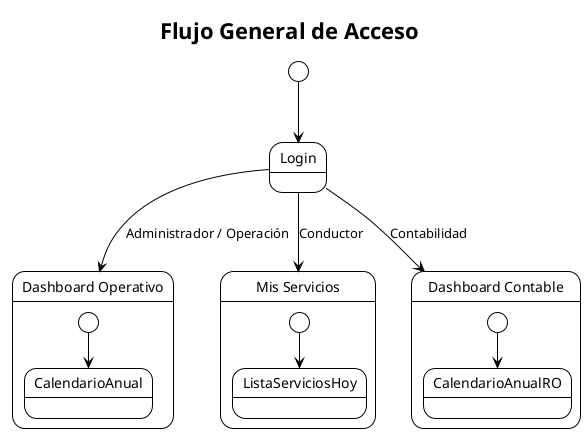
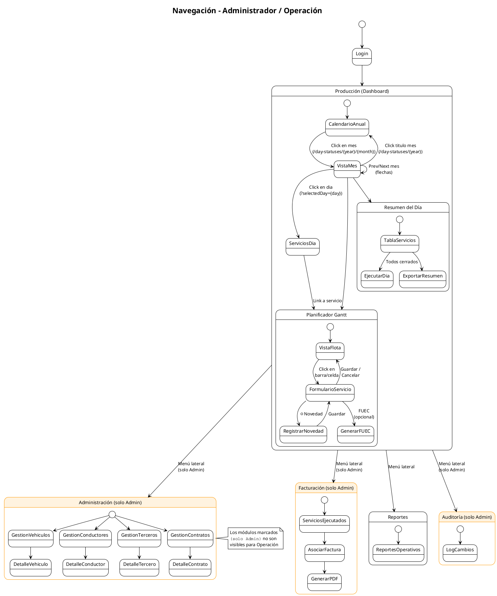
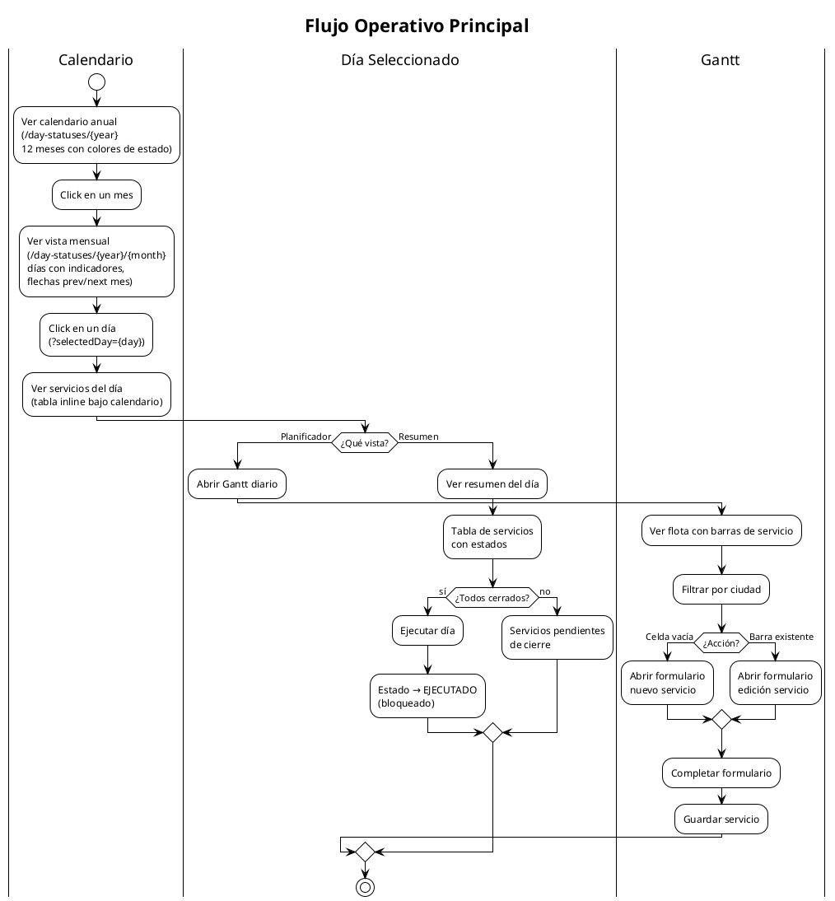
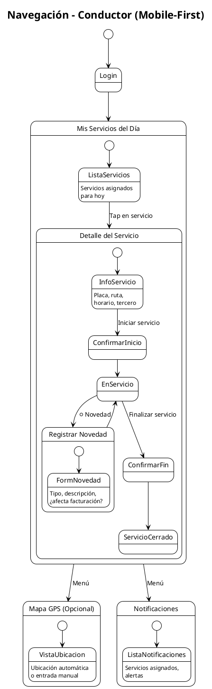
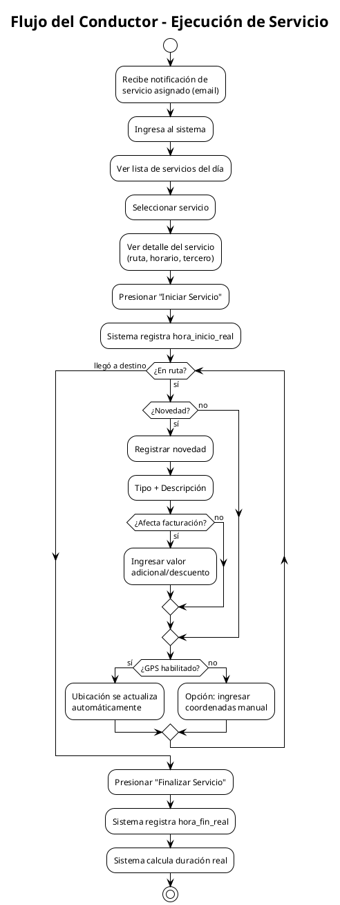
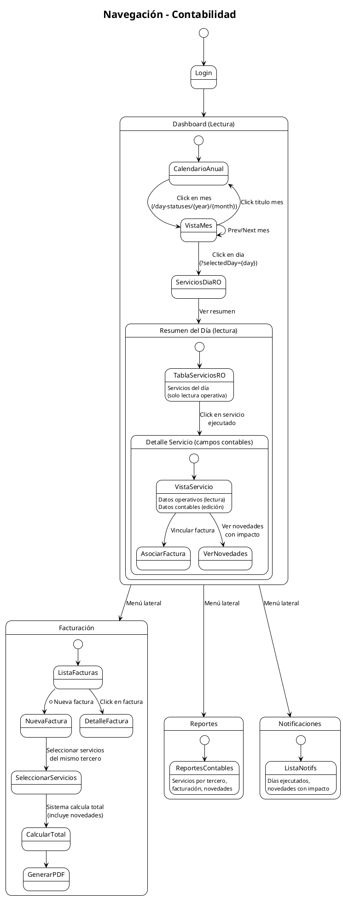
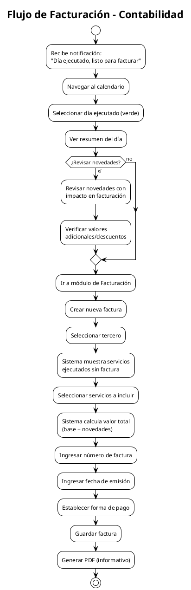

# Navigation Map by Role - SGTE

Document describing the application's navigation structure for each role in the system, grouping roles when they share the same experience.

## Access summary by role

| Module / View             | Administrador | Operación | Conductor | Contabilidad |
| ------------------------- | :-----------: | :-------: | :-------: | :----------: |
| Login                     |       ✓       |     ✓     |     ✓     |      ✓       |
| Dashboard                 |       ✓       |     ✓     |     -     |      ✓       |
| Calendario anual/mensual  |       ✓       |     ✓     |     -     |      ✓       |
| Gantt diario              |       ✓       |     ✓     |     -     |      -       |
| Formulario de servicio    |       ✓       |     ✓     |     -     |      -       |
| Resumen del día           |       ✓       |     ✓     |     -     |      ✓       |
| Ejecutar día              |       ✓       |     ✓     |     -     |      -       |
| Gestión de vehículos      |       ✓       |     -     |     -     |      -       |
| Gestión de conductores    |       ✓       |     -     |     -     |      -       |
| Gestión de terceros       |       ✓       |     -     |     -     |      -       |
| Gestión de contratos      |       ✓       |     -     |     -     |      -       |
| Mis servicios (móvil)     |       -       |     -     |     ✓     |      -       |
| Registrar inicio/fin      |       -       |     -     |     ✓     |      -       |
| Registrar novedades       |       ✓       |     ✓     |     ✓     |      -       |
| Facturación               |       ✓       |     -     |     -     |      ✓       |
| Servicios ejecutados      |       ✓       |     -     |     -     |      ✓       |
| Generar FUEC (opcional)   |       ✓       |     ✓     |     -     |      -       |
| Mapa GPS (opcional)       |       ✓       |     ✓     |     ✓     |      -       |
| Log de auditoría          |       ✓       |     -     |     -     |      -       |
| Reportes                  |       ✓       |     ✓     |     -     |      ✓       |
| Notificaciones            |       ✓       |     ✓     |     ✓     |      ✓       |

---

## 1. General navigation (all roles)

All users access the system through the same login screen. After authenticating, the system redirects the user to the main view corresponding to their role.

---

## 2. Administrador and Operación

These two roles share the main navigation (calendar → Gantt → services). The difference is that **Administrador** has additional access to the administration menu (master data, audit) and can edit executed records with justification.

### Sidebar menu

| Section              | Administrador | Operación |
| -------------------- | :-----------: | :-------: |
| Producción           |       ✓       |     ✓     |
| Vehículos            |       ✓       |     -     |
| Conductores          |       ✓       |     -     |
| Terceros             |       ✓       |     -     |
| Contratos            |       ✓       |     -     |
| Facturación          |       ✓       |     -     |
| Reportes             |       ✓       |     ✓     |
| Auditoría            |       ✓       |     -     |
| FUEC (opcional)      |       ✓       |     ✓     |
| Mapa GPS (opcional)  |       ✓       |     ✓     |

### Full navigation map

### Main flow: Calendario → Gantt → Servicio

### Behavior differences by role

| Context                        | Administrador                            | Operación                    |
| ------------------------------ | ---------------------------------------- | ---------------------------- |
| Service on PROYECTADO day      | Create / Edit / Delete                   | Create / Edit / Delete       |
| Service on EJECUTADO day       | Edit with mandatory justification        | Read-only                    |
| Novedades                      | Register from the service form           | Register from the form       |
| Administración menu            | Visible (Vehículos, Conductores, etc.)   | Not visible                  |
| Facturación menu               | Visible                                  | Not visible                  |
| Auditoría menu                 | Visible                                  | Not visible                  |

---

## 3. Conductor

The driver has a simplified, mobile-oriented interface. They do not access the calendar or the Gantt. Their main view is the list of services assigned for the current day.

### Menu

| Section              | Access |
| -------------------- | :----: |
| Mis Servicios        |   ✓    |
| Mapa GPS (opcional)  |   ✓    |
| Notificaciones       |   ✓    |
| Mi Perfil            |   ✓    |

### Navigation map

### Driver flow during a service

---

## 4. Contabilidad

The Contabilidad role accesses the calendar in read mode to navigate to executed days. Its focus is billing and reviewing finalized services. It can edit accounting fields of services on executed days.

### Sidebar menu

| Section                 | Access |
| ----------------------- | :----: |
| Calendario (lectura)    |   ✓    |
| Servicios Ejecutados    |   ✓    |
| Facturación             |   ✓    |
| Reportes                |   ✓    |
| Notificaciones          |   ✓    |

### Navigation map

### Billing flow

---

## 5. Sidebar menu structure

Consolidated representation of the sidebar menu visible to each role.

```plantuml
@startsalt
{
  {T
    + <b>SGTE - Menú Principal</b>
    ++ <&home> Producción (Dashboard)       | <color:green>A</color> <color:blue>O</color> <color:gray>C$</color>
    +++ Calendario Anual                     | <color:green>A</color> <color:blue>O</color> <color:gray>C$</color>
    +++ Gantt Diario                         | <color:green>A</color> <color:blue>O</color>
    +++ Resumen del Día                      | <color:green>A</color> <color:blue>O</color> <color:gray>C$</color>
    ++ <&wrench> Administración              | <color:green>A</color>
    +++ Vehículos                            | <color:green>A</color>
    +++ Conductores                          | <color:green>A</color>
    +++ Terceros                             | <color:green>A</color>
    +++ Contratos                            | <color:green>A</color>
    ++ <&truck> Mis Servicios                | <color:red>Co</color>
    ++ <&dollar> Facturación                 | <color:green>A</color> <color:gray>C$</color>
    +++ Facturas                             | <color:green>A</color> <color:gray>C$</color>
    +++ Servicios Ejecutados                 | <color:green>A</color> <color:gray>C$</color>
    ++ <&bar-chart> Reportes                 | <color:green>A</color> <color:blue>O</color> <color:gray>C$</color>
    ++ <&document> FUEC (Opcional)           | <color:green>A</color> <color:blue>O</color>
    ++ <&map-marker> Mapa GPS (Opcional)     | <color:green>A</color> <color:blue>O</color> <color:red>Co</color>
    ++ <&eye> Auditoría                      | <color:green>A</color>
    ++ <&bell> Notificaciones                | <color:green>A</color> <color:blue>O</color> <color:red>Co</color> <color:gray>C$</color>
  }
  ---
  <color:green>A</color> = Admin  |  <color:blue>O</color> = Operación  |  <color:red>Co</color> = Conductor  |  <color:gray>C$</color> = Contabilidad
}
@endsalt
```

---

## Reference

- [SRS - Section 3: Navigation Architecture](SRS.md#3-navigation-architecture)
- [SRS - Section 7: Roles and Permissions](SRS.md#7-roles-and-permissions)
